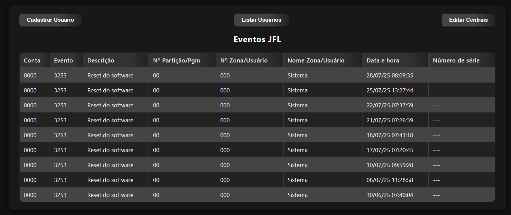

# 🤖 Boctok - Monitor de Eventos para JFL Active Net

Uma ferramenta de ponta para automatizar a análise de ocorrências de centrais de alarme em tempo real, criada para transformar dados complexos em insights diretos e práticas.

---

## 🚀 Visão Geral



O **Boctok** é um programa para Windows que simplifica o acompanhamento dos eventos no sistema JFL Active Net 3. Ele opera discretamente, lendo a página de eventos e avisando você sobre novas ocorrências assim que acontecem.

Ele dispensa o acompanhamento manual e as atualizações de página, mostrando os dados numa interface web moderna e com atualização automática.

## ✨ Principais Funcionalidades


*   **Monitoramento Contínuo:** Realiza a verificação da página de eventos em tempo real, identificando novas ocorrências assim que são registradas.
*   **Notificações Seletivas:** Emite alertas sonoros e visuais para eventos críticos, com a funcionalidade de ignorar ocorrências de rotina (ex: ativação e desativação do sistema).
*   **Interface Web Moderna:** Apresenta os dados em uma tabela organizada, estilizada e fácil de ler.
*   **Gerenciamento de Nomes:** Permite a personalização de nomes para usuários, zonas e locais, substituindo códigos numéricos por identificadores claros (ex: "Usuário 007" se torna "Porta da Frente").
*   **Acesso Remoto Seguro:** A interface de monitoramento pode ser acessada por outros dispositivos na mesma rede local, com autenticação baseada nas credenciais do sistema de origem.
*   **Aplicação Standalone:** Distribuído como um único executável (`.exe`), o que simplifica a instalação e o uso, sem dependências externas para o usuário final.

## ⚙️ Como o Sistema Funciona

O **Boctok** usa as seguintes tecnologias para oferecer uma solução eficiente:

*   **Automação (Selenium):** Realiza o acesso automatizado à página de eventos da central, simulando a interação de um usuário para login e navegação.
*   **Extração de Dados (BeautifulSoup & Pandas):** Analisa a estrutura HTML da página, extrai e organiza os dados tabulados dos eventos.
*   **Backend (Flask):** Um servidor web local gerencia os dados extraídos, serve a interface de usuário e processa as requisições de CRUD (Create, Read, Update, Delete) para o cadastro de usuários e centrais.
*   **Frontend (HTML, CSS, JS):** Uma interface web dinâmica é gerada para exibir os eventos em tempo real e permitir o gerenciamento dos cadastros através de modais interativos.

Todo o processamento acontece no seu computador, garantindo a velocidade e a segurança dos dados.

## 📋 Como Instalar e Usar

### Requisitos

### Para Usuário Final

1.  Execute o arquivo `Boctok.exe`.
2.  Na janela de diálogo, insira o **usuário**, a **senha** e a **porta** de acesso ao sistema de origem.
3.  Após a autenticação, uma nova aba será aberta no seu navegador padrão, exibindo a interface de monitoramento.
4.  Utilize os botões **"Cadastrar Usuário"**, **"Listar Usuários"** e **"Editar Centrais"** para personalizar os identificadores e otimizar a visualização dos eventos.

---

### Para Desenvolvedores

Para executar o projeto a partir do código-fonte, siga os passos abaixo.

#### 1. Requisitos 📋

*   **Sistema Operacional:** Windows
*   **Software de Origem:** JFL Active Net 3
*   **Python:** Versão 3.10 ou superior

#### 2. Instalação do Python 🐍

*   Baixe o instalador do Python em: https://www.python.org/downloads/windows/
*   Durante a instalação, é crucial marcar a opção **"Add Python to PATH"**.
*   Após a instalação, verifique se foi bem-sucedida abrindo o Prompt de Comando (cmd) e digitando:
    ```bash
    python --version
    ```

#### 3. Instalação das Dependências 📦

*   Com o Python instalado, abra o Prompt de Comando e instale os pacotes necessários com o seguinte comando:
    ```bash
    pip install selenium beautifulsoup4 pandas requests flask waitress flask-httpauth
    ```

#### 4. Executando o Projeto ▶️

*   Navegue até a pasta do projeto no Prompt de Comando.
*   Execute o script principal:
    ```bash
    python WebScraping.py
    ```

#### 5. Gerando o Executável (Opcional) 🏗️

*   Para compilar o projeto em um arquivo `.exe`, instale o `cx_Freeze`:
    ```bash
    pip install cx_Freeze
    ```
*   Em seguida, execute o script de setup:
    ```bash
    python setup.py build
    ```
*   O executável `Boctok.exe` será criado na pasta `build`.
